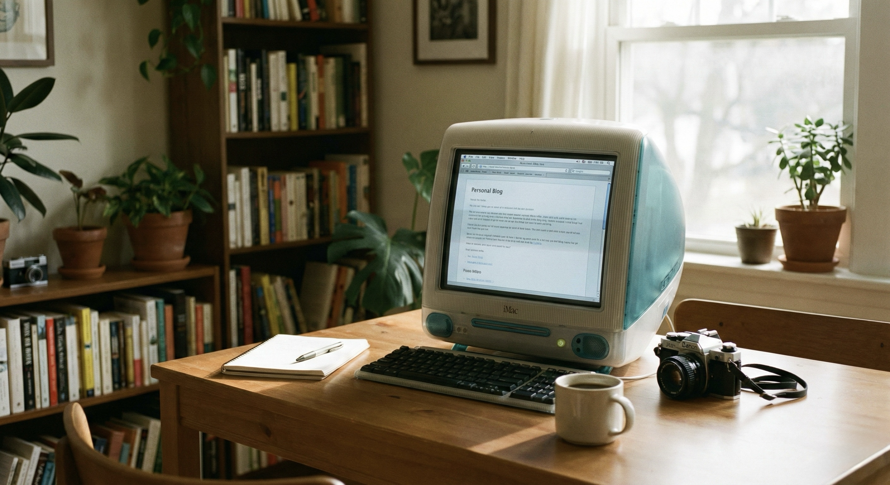

O primeiro _long-post_ no blog não poderia ser diferente: precisava contar o que me fez sair das redes sociais e me aventurar na criação deste blog. O desejo de criar um blog não é recente e remete ao início dos anos 2000. Não vou escrever neste post toda essa história, até porque ficaria enfadonho, mas, em publicações futuras, pretendo contar um pouco de como surgiu a minha vontade de criar um blog.

Recordo-me de que, naquela época, navegava pela internet e via uma enxurrada de blogs sobre os mais diversos assuntos. Com o tempo, essa quantidade de sites, que tinham a cara de seus criadores, foi diminuindo e dando lugar às grandes empresas de tecnologia e às suas redes sociais centralizadas. Foi então que surgiram os hoje falecidos Orkut (2004) e MySpace (2002/2003), bem como os ainda em operação Facebook (2004), Twitter/X (2006) e LinkedIn (2003), entre outros menos conhecidos.

Com a evolução dessas redes, passei a experimentar um ambiente saturado por propagandas, rastreadores, robôs, manipulações de feed, algoritmos viciantes e as já famigeradas rolagens infinitas. Havia momentos em que entrava em um túnel que, quando me dava conta, já haviam se passado vários minutos da minha vida, fazendo absolutamente nada. **Precisava parar!**

Nessa busca por uma alternativa, resolvi me afastar cada vez mais das redes sociais tradicionais e centralizadas para me aventurar na blogosfera. Após inúmeras tentativas frustradas de conectar o blog aos protocolos [ActivityPub](https://activitypub.rocks/) e [AT Protocol](https://atproto.com/), a fim de obter interações vindas do [Mastodon](https://mastodon.social/@vercosa) e do [Bluesky](https://bsky.app/profile/tiagolima.me), respectivamente, veio a escolha pelo [Micro.blog](https://micro.blog/vercosa). A plataforma ofereceu diversas facilidades, permitindo a publicação tanto de posts curtos quanto de ensaios mais longos, além do _cross-posting_ entre várias plataformas, poupando-me um tempo que muitas vezes não tenho.

Por meio de um agregador, consegui reencontrar uma tranquilidade na internet que havia anos não experimentava. Agora sigo apenas blogs sobre temas que realmente me interessam e que agregam de alguma forma, seja por conhecimento, informação ou simples distração. E, se eu puder lhe dar uma sugestão: crie um blog e fuja das manipulações que as redes sociais nos impõem.
