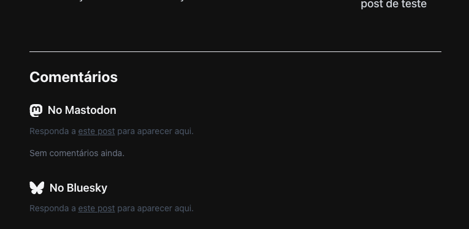
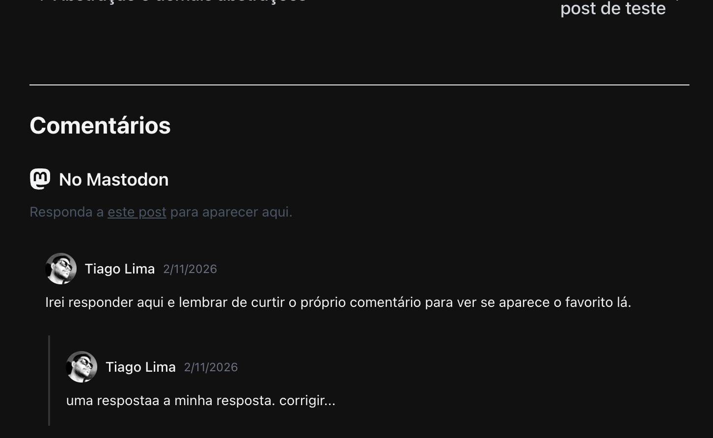
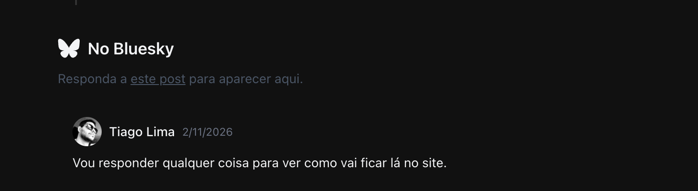

Desde quando surgiu a ideia de construir um blog pessoal, pairava na minha mente o seguinte questionamento: após escrever os posts e publicá-los, como seria a interação entre o leitor e o texto? Eu sentia que, sem essa comunicação, os meus posts estariam isolados, sem ninguém conseguir interagir com eles. Já nos meus primeiros testes, quando fiz o _deploy_ de um pequeno blog, foi exatamente assim que me senti. Não tinha campo para interação, comentários, compartilhamento, nada. Era apenas um texto em uma página web.

Partindo da premissa de que, necessariamente, deveria existir um modo pelo qual os leitores pudessem comentar em meus textos, não faria sentido algum manter um blog sem essa funcionalidade! Posterguei por um longo período a ideia de colocar um blog no ar.

Como alternativa, conheci o Micro.blog, um serviço de _microblogging_ que oferece a funcionalidade de _crossposting_, permitindo que os leitores interajam por diferentes plataformas. Diante disso, decidi que, enquanto não implementasse um sistema próprio de comentários no site, publicaria meus textos por meio do Micro.blog.

## Uma solução para os comentários

Com o passar do tempo e muitas horas de pesquisas, código e, claro, uma ajudinha do Gemini, encontrei uma abordagem chamada **client-side fetching** que, basicamente, é o nome dado ao método quando os dados de uma aplicação web são requisitados e processados diretamente no navegador do usuário. O fluxo funciona da seguinte maneira:

1. Você publica o post no blog;
2. divulga o link no Mastodon e no Bluesky;
3. pega o ID dessas postagens nas redes sociais;
4. Insere os IDs no "Front Matter" do post no blog; e
5. Um código JavaScript carrega as respostas automaticamente.

A configuração do código do blog depende diretamente do tema adotado, pois cada tema define de forma própria a organização das hierarquias de pastas e dos arquivos de configuração. Para a construção deste blog, foi utilizado o tema [Hextra](https://imfing.github.io/hextra/). Ao analisar sua estrutura interna, observei que a implementação do sistema de comentários deve ser realizada no diretório `.../layouts/_partials/components/comments.html`. Nesse local, deve ser inserido [o código JavaScript](https://gist.github.com/tiagovercosa/9c52869e09e06a0352ed05e84ee388e0) responsável por buscar e renderizar os comentários a partir dos servidores.

Após concluir a configuração, ao criar um novo post, o front matter do arquivo Markdown deve incluir os seguintes metadados:

```md
---
# ...
mastodon_id: "111892..."
bluesky_id: "po4fq..."
# ...
---

Seu texto...
```

Com esses dados devidamente inseridos, o post passa a ser integrado aos conteúdos correspondentes nas duas principais redes sociais descentralizadas: Mastodon e Bluesky.



### Mastodon

Após publicar o post no Mastodon, acesse a publicação e copie sua URL. Normalmente, ela terá um formato semelhante a `https://mastodon.social/@usuario/1118923456789`. O identificador do post corresponde à sequência numérica localizada ao final da URL.



### Bluesky

O procedimento no Bluesky é equivalente. Depois de publicar o post, acesse a publicação e copie sua URL, que geralmente segue o formato `https://bsky.app/profile/usuario.bsky.social/post/3ksc5mn4opq2`. Nesse caso, o identificador do post é o código alfanumérico presente ao final da URL.



## Postagens conectadas

Como mencionado no início deste post, o processo para habilitar comentários nas publicações exigiu um tempo considerável de experimentação e certo domínio técnico, além de algum tipo de ajudinha de ferramentas de IA.

Com a configuração concluída, as postagens deixam de parecer conteúdos isolados em um espaço estático e passam a integrar um ambiente efetivamente interativo, no qual há possibilidade real de diálogo e retorno por parte dos leitores. Colocando por terra aquela sensação de que tinha um conteúdo em um limbo inacessível.

<meta name="fediverse:creator" content="@vercosa@mastodon.social">
